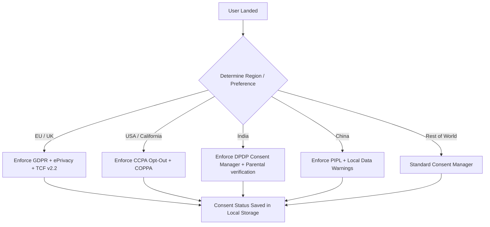

# Technical Architecture Specification (Architecture.md)

This document describes the technical architecture and compliance framework for **BlueTEXT.in**. As a local-first, serverless utility suite containing over 1,000 tools, the platform offloads execution to the client's browser, providing extreme speed, privacy, and off-grid performance.

---

## 1. Client-Side Runtime & Infrastructure

### A. Directory Layout & Categorization (1,000+ Tools Namespace)
To structure the platform for human developers, search crawlers, and AI parsers, the codebase organizes all 1,000+ utilities into 10 explicit directory categories under `/tools/`:

```
/ (Root)
├── index.html                  # Landing page & search interface
├── DESIGN.md                   # Brand guidelines & accessibility rules
├── Architecture.md             # System design & compliance mapping
├── assets/
│   ├── css/                    # themes.css, base.css, components.css
│   ├── js/                     # app.js, router.js, service-worker.js
│   └── data/                   # tools.json index metadata
├── components/
│   ├── header.html             # Dynamic global header component
│   └── footer.html             # Dynamic global footer containing compliance chips
└── tools/                      # The modular utility suite namespace
    ├── text/                   # Text Case converter, Line sorter, Markdown editor
    ├── code/                   # JSON formatter, SQL beautifier, Regex tester
    ├── converter/              # CSV/JSON converter, Base64 encoder, XML converter
    ├── image/                  # Image compressor, Resize tool, SVG editor
    ├── video/                  # Frame extractor, Metadata reader, subtitle editor
    ├── audio/                  # Sound inspector, Pitch shifter, wave generator
    ├── calculator/             # Unit converter, Financial tools, Date differences
    ├── security/               # Password generator, Cryptographic hashing (SHA/MD5)
    ├── network/                # DNS lookups, Client header viewer, Ping tests
    └── social/                 # Meta tag generators, URL preview card builders
```

### B. Client-Side Database-Less Routing
- **`tools.json` metadata index**: Loaded once on application startup. Contains searchable metadata, tagging structures, and keywords for all 1,000+ tools.
- **Dynamic Loader**: The client-side runtime dynamically parses the folder index and renders cards on the home page dashboard.

---

## 2. Universal Privacy Engine (Regional Consent Mapping)
To satisfy multi-jurisdiction privacy mandates globally, the platform uses a **Zero-Database Consent Engine** running client-side.



### A. Geographic Compliance Triggers
Region categorization is determined via a client-side lookup (IP location API or regional selection dropdown in the header/footer).

- **GDPR & ePrivacy (Europe)**:
  - **Opt-In Requirement**: No advertising or analytics scripts can load until consent is explicitly granted (Strict Opt-In).
  - **Right to be Forgotten**: A "Privacy Preferences -> Reset Data" button in the footer wipes all `localStorage`, `sessionStorage`, `IndexedDB` stores, and local caches instantly.
- **CCPA / CPRA & COPPA (United States)**:
  - **Opt-Out Control**: A permanent footer link reading `"Do Not Sell My Personal Information"` sets a localized tracking-exclusion flag.
  - **COPPA Age-Gate**: Financial or analytical tracking is disabled for users self-declaring as under 13.
- **DPDP Act 2023 (India)**:
  - **Data Fiduciary Protocol**: Clearly present details about data usage.
  - **Consent Manager Interface**: Allow users to withdraw consent item-by-item (e.g., separating functional tool storage from advertisement tracking).
  - **Parental Consent Gate**: Implement a strict age-verification gate for minors (under 18) before activating ad rendering.
- **PIPL (China)**:
  - Show a compliance notice confirming that all data processes occur locally on the user's machine (complying with data localization requirements).
- **LGPD (Brazil)**:
  - Provide a dynamic contact point for the local Data Protection Officer (DPO) in the Privacy Policy modal.

### B. Ads & Analytics Script Consent Flow
Third-party monetization scripts must be gated behind the client's consent registry state:
1. **Google AdSense (IAB TCF v2.2)**: Ad tags are injected into designated container widgets only after the Consent Management Platform (CMP) resolves the consent cookie (`tcString`).
2. **Google Analytics & Facebook Pixel**: Integrated via dynamic script loaders that inject the tracker triggers conditionally matching Google Consent Mode v2 variables:
   ```javascript
   function injectAnalytics() {
     if (localStorage.getItem('btConsent.v1') === 'accepted') {
       // Load Google Analytics & FB Pixel tags dynamically
     }
   }
   ```

---

## 3. Financial, E-Commerce & Payment Architecture (PCI-DSS)
To facilitate donations, subscriptions, and shop products without security liabilities, the site offloads operations using client-side integrations:

- **Patreon / Buy Me a Coffee**: Dynamic card links loading external checkout portals.
- **Stripe & Razorpay Embedded Checkouts**: Payments are processed using Stripe Elements or Razorpay Checkout scripts. Both options securely capture credit card digits inside iframe overlays, returning transaction authorization tokens directly to the front-end, maintaining **PCI-DSS SAQ A** compliance.
- **Gumroad Shop Integration**: Gumroad products are linked via a local product grid. When clicked, they load Gumroad's official lightweight overlay script (`https://gumroad.com/js/embed.js`), initiating checkout directly within a client-side frame.

---

## 4. Cloudflare Hosting & Subdomain Routing
The project is deployed using **Cloudflare Pages**, configured with custom routing rules:

- **Custom Domain**: Managed by Cloudflare DNS, pointing to Godaddy registration.
- **Subdomain Routing (`blog.bluetext.in`)**:
  - The blogging system is delegated to a dedicated sub-page configuration (`blog.bluetext.in`) utilizing Cloudflare's routing configurations.
  - Static routing rules configured in `_headers` enforce HSTS, secure cache headers, and strict Content Security Policies (CSP):
    ```http
    Content-Security-Policy: default-src 'self'; script-src 'self' https://js.stripe.com https://checkout.razorpay.com https://gumroad.com https://www.google-analytics.com; style-src 'self' 'unsafe-inline' https://fonts.googleapis.com;
    ```
