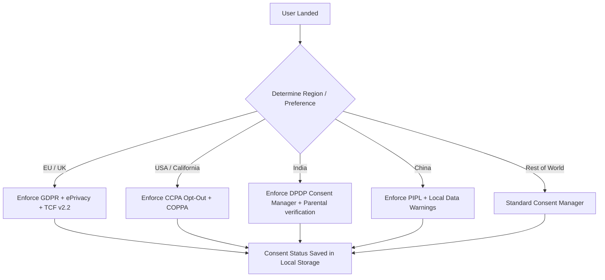

# Technical Architecture Specification (Architecture.md)

This document describes the technical architecture and compliance framework for **BlueTEXT.in**. As a local-first, serverless utility suite containing over 1,000 tools, the platform offloads execution to the client's browser, providing extreme speed, privacy, and off-grid performance.

---

## 1. Client-Side Runtime & Infrastructure

### A. Local-First Sandboxed Model
- **Zero Server Processing**: All file parsing (CSV, PDF, JSON), image manipulation, and text processing must occur entirely in the user's browser memory (local runtime). No user content is sent to external servers.
- **Client Router**: A lightweight vanilla JS router coordinates file loads asynchronously to prevent complete page reloads, using partial template fetching.
- **Offline Reliability (PWA)**: Service workers cache design systems (`/assets/css/`), scripts (`/assets/js/`), and tool components (`/components/`) locally for full offline availability.

---

## 2. Universal Privacy Engine (Regional Consent Mapping)
To satisfy multi-jurisdiction privacy mandates globally, the platform uses a **Zero-Database Consent Engine** running client-side.



### A. Geographic Compliance Triggers
Region categorization is determined via a client-side lookup (IP location API or regional selection dropdown in the header/footer).

- **GDPR & ePrivacy (Europe)**:
  - **Opt-In Requirement**: No advertising or analytics scripts can load until consent is explicitly granted (Strict Opt-In).
  - **Right to be Forgotten**: A "Privacy Preferences -> Reset Data" button in the footer wipes all `localStorage`, `sessionStorage`, `IndexedDB` stores, and local caches instantly.
- **CCPA / CPRA & COPPA (United States)**:
  - **Opt-Out Control**: A permanent footer link reading `"Do Not Sell My Personal Information"` sets a localized tracking-exclusion flag.
  - **COPPA Age-Gate**: Financial or analytical tracking is disabled for users self-declaring as under 13.
- **DPDP Act 2023 (India)**:
  - **Data Fiduciary Protocol**: Clearly present details about data usage.
  - **Consent Manager Interface**: Allow users to withdraw consent item-by-item (e.g., separating functional tool storage from advertisement tracking).
  - **Parental Consent Gate**: Implement a strict age-verification gate for minors (under 18) before activating ad rendering.
- **PIPL (China)**:
  - Show a compliance notice confirming that all data processes occur locally on the user's machine (complying with data localization requirements).
- **LGPD (Brazil)**:
  - Provide a dynamic contact point for the local Data Protection Officer (DPO) in the Privacy Policy modal.

### B. Monetization Consent Integration (TCF v2.2 & Google Consent Mode v2)
1. **IAB Transparency & Consent Framework (TCF v2.2)**:
   - Integrate a compatible Consent Management Platform (CMP) to generate standard consent strings (`tcString`).
   - The ad container reads this string and signals it to ad networks (Google AdSense/AdManager) to conditionally render personalized or non-personalized ads.
2. **Google Consent Mode v2**:
   - Programmatically update consent states (`analytics_storage` and `ad_storage`) based on user selection:
     ```javascript
     gtag('consent', 'update', {
       'ad_storage': 'granted',
       'analytics_storage': 'denied'
     });
     ```

---

## 3. Financial & Payment Processing Architecture (PCI-DSS)
To receive donations and subscriptions without liability, the platform implements strict data segregation:

- **PCI-DSS SAQ A Compliance**: BlueTEXT.in never processes, stores, or transmits credit card numbers.
- **Tokenized iframe Gateways**: Use Stripe Elements or PayPal Checkout iframes. The user's browser transmits credit card details directly to Stripe's servers; the platform only handles a secure transaction token.

---

## 4. Security & Trust Architecture

### A. ISO 27001 Alignment
Even as a client-side application, standard security controls apply:
- **A.12.6.1 Technical Vulnerability Management**: Weekly static scans of third-party libraries.
- **A.14.2.5 Secure System Engineering Principles**: Enforce Content Security Policy (CSP) headers to restrict scripts:
  ```http
  Content-Security-Policy: default-src 'self'; script-src 'self' https://js.stripe.com; style-src 'self' 'unsafe-inline' https://fonts.googleapis.com;
  ```

### B. FISMA Security Baselines
- **System and Communications Protection (SC)**: Complete encryption of in-transit assets.
- **Transport Security**: Mandatory TLS 1.3 for all endpoints. Enforce Strict-Transport-Security (HSTS) headers.
